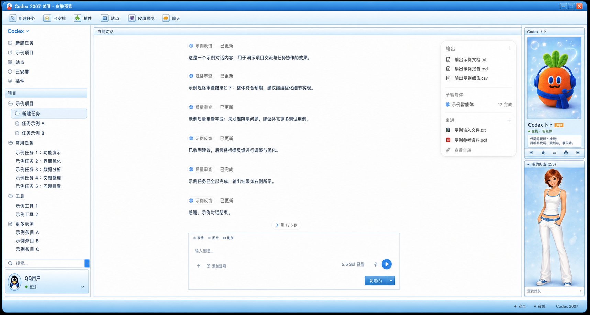

# CodexSkinQQ

一套面向 macOS Codex 客户端的 QQ 2007 风格复古窗口皮肤，基于
[Codex Dream Skin](https://github.com/Fei-Away/Codex-Dream-Skin) 扩展。



皮肤保留 Codex 原生任务、对话、输入框和文档面板的交互能力，在其外层增加：

- QQ 2007 风格蓝色标题栏、工具栏、状态栏和窗口按钮
- 分组式项目/任务侧栏
- 复古聊天内容、代码块、输入区和发送按钮
- “Codex 卜卜”客服档案与好友栏
- 宠物窗口隔离，保留宠物活动气泡文字
- 可重复执行的安装、更新和恢复脚本

> 这是非官方社区主题，与腾讯、QQ 或 OpenAI 无隶属关系。仓库不包含聊天记录、
> 账号信息或制作者本机路径。

## 快速安装

### 方式一：下载完整安装包

1. 下载 [`dist/Codex-QQ2007-Skin-macOS.zip`](dist/Codex-QQ2007-Skin-macOS.zip)。
2. 解压 ZIP。
3. 双击 `安装 QQ2007 皮肤.command`。
4. 按终端提示完成安装。

安装器不会强制退出或重启 Codex。首次安装 Dream Skin 后如需重新打开客户端，
请使用安装器创建的桌面启动器。

### 方式二：从源码安装

前置条件：

- macOS
- 已安装 Codex 客户端
- 已安装 [Codex Dream Skin](https://github.com/Fei-Away/Codex-Dream-Skin)
- Node.js 18 或更高版本

```bash
node tools/qq2007/install-extension.mjs install \
  --engine "$HOME/.codex/codex-dream-skin-studio" \
  --source "$PWD/themes/retro-qq-2007"
```

切换到主题：

```bash
"$HOME/.codex/codex-dream-skin-studio/scripts/switch-theme-macos.sh" \
  --id retro-qq-2007
```

## 恢复

安装包用户可双击：

```text
恢复原始皮肤.command
```

源码用户可执行：

```bash
node tools/qq2007/install-extension.mjs restore \
  --engine "$HOME/.codex/codex-dream-skin-studio"
```

## 开发与测试

运行全部测试：

```bash
node --test tools/qq2007/*.test.mjs
```

重新生成分享安装包：

```bash
node tools/qq2007/package-installer.mjs
```

项目结构：

```text
themes/retro-qq-2007/       主题配置、图片、窗口结构与样式
tools/qq2007/               安装器、打包器和自动化测试
tools/qq2007/installer-assets/
                             双击安装/恢复脚本与包内说明
dist/                        可直接分享的 macOS ZIP
```

## 兼容性说明

皮肤依赖 Codex 当前的界面结构。Codex 大版本更新后，部分选择器可能需要同步调整。
安装器会检查 Dream Skin 的关键代码锚点；遇到未知版本时会拒绝写入，而不是猜测修改。

## 素材说明

仓库中的人物、企鹅与“卜卜”客服图片为项目定制素材或由图像生成工具辅助创作，
不包含 QQ 秀原图或腾讯官方企鹅素材。

## License

[MIT](LICENSE)
